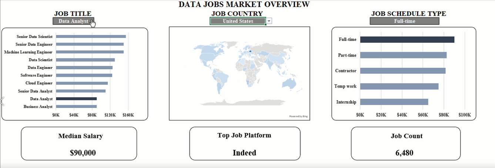

# 📊 Data Jobs Market Overview Dashboard

An interactive Microsoft Excel dashboard that analyzes the global data jobs market using dynamic formulas, Pivot Tables, Pivot Charts, and Data Validation. The dashboard allows users to explore salary trends and job demand by filtering **Job Title**, **Country**, and **Job Schedule Type**.

---

## 📷 Dashboard Preview



---

## 📌 Project Overview

This project was built to provide an interactive overview of the data jobs market. Users can dynamically filter the dashboard to analyze:

- Median salaries across different data roles
- Job demand by title
- Hiring distribution across countries
- Employment type distribution
- Top job posting platforms
- Total job postings matching selected filters

The dashboard is built entirely in Microsoft Excel without using VBA, demonstrating the power of modern Excel functions and dashboard design.

---

## 🎯 Dashboard Features

### Dynamic Filters

The dashboard includes interactive dropdowns for:

- Job Title
- Job Country
- Job Schedule Type

All charts and KPI cards update automatically based on the selected filters.

---

### Visualizations

- 📈 Median Salary by Job Title
- 🌍 Global Job Distribution Map
- 📊 Job Count by Schedule Type
- 🏆 Top Job Platform
- 🔢 Total Job Count
- 💰 Median Salary KPI

---

## 🛠 Tools & Skills Used

- Microsoft Excel
- Pivot Tables
- Pivot Charts
- Data Validation
- Dynamic Array Formulas
- Structured Table References
- Conditional Formatting
- Bing Maps
- Dashboard Design
- Data Analysis

---

# 📐 Excel Formulas Used

## 1. Filter Job Schedule Types

Removes unwanted values and schedule types containing the word **"and"**.

```excel
=FILTER(
    G2#,
    (NOT(ISNUMBER(SEARCH("and",G2#))))
    *
    (G2#<>0)
)
```

---

## 2. Count Jobs by Selected Filters

Counts job postings matching the selected Job Title, Country, and Schedule Type.

```excel
=COUNT(
IF(
(jobs_data[job_title_short]=A2)*
(jobs_data[job_country]=country)*
(ISNUMBER(SEARCH(type,jobs_data[job_schedule_type]))),
jobs_data[salary_year_avg]
))
```

---

## 3. Median Salary by Job Title

Calculates the median salary for each job title based on the selected country and schedule type.

```excel
=MEDIAN(
IF(
(jobs_data[job_title_short]=A2)*
(jobs_data[job_country]=country)*
(ISNUMBER(SEARCH(type,jobs_data[job_schedule_type])))*
(jobs_data[salary_year_avg]<>""),
jobs_data[salary_year_avg]
))
```

---

## 4. Median Salary by Country

Calculates the median salary for each country while respecting the selected dashboard filters.

```excel
=MEDIAN(
IF(
(jobs_data[job_country]=A2)*
(jobs_data[job_title_short]=title)*
(ISNUMBER(SEARCH(type,jobs_data[job_schedule_type])))*
(jobs_data[salary_year_avg]<>""),
jobs_data[salary_year_avg]
))
```

---

## 5. Median Salary by Schedule Type

Calculates the median salary for each employment type.

```excel
=MEDIAN(
IF(
(ISNUMBER(SEARCH(A2,jobs_data[job_schedule_type])))*
(jobs_data[job_title_short]=title)*
(jobs_data[job_country]=country)*
(jobs_data[salary_year_avg]<>""),
jobs_data[salary_year_avg]
))
```

---

## 6. Count Jobs by Job Platform

Counts the number of job postings from each platform based on the selected filters.

```excel
=COUNT(
IF(
(A2=jobs_data[job_via])*
(jobs_data[job_title_short]=title)*
(jobs_data[job_country]=country)*
(ISNUMBER(SEARCH(type,jobs_data[job_schedule_type]))),
jobs_data[salary_year_avg]
))
```

---

# 🚀 Key Insights

The dashboard helps answer questions such as:

- Which data jobs offer the highest median salaries?
- Which countries have the most opportunities?
- Which employment types are most common?
- Which platforms post the most data jobs?
- How many jobs match specific search criteria?

---

# 📚 Skills Demonstrated

- Excel Dashboard Development
- Interactive Reporting
- Dynamic Excel Functions
- Data Visualization
- Business Intelligence
- Statistical Analysis
- Dashboard Design
- Analytical Thinking

## 📌 Conclusion

This project demonstrates how Microsoft Excel can be used to build a powerful and interactive business intelligence dashboard without relying on VBA or external tools. By combining dynamic array formulas, Pivot Tables, charts, and data validation, the dashboard transforms raw job posting data into meaningful insights that support data-driven decision-making.

Through interactive filtering, users can explore salary trends, job demand, geographic distribution, and hiring platforms across different roles and employment types. The project showcases practical Excel skills commonly used in data analytics, including data analysis, dashboard design, statistical calculations, and dynamic reporting.
